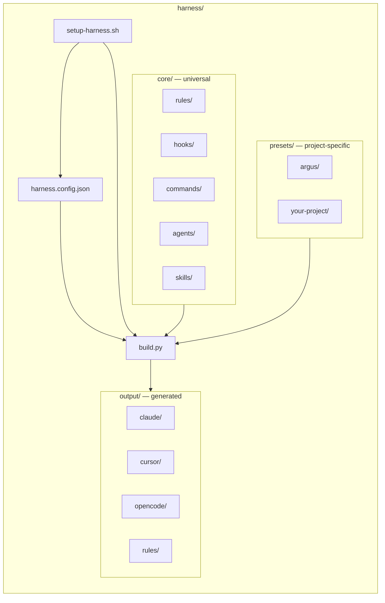
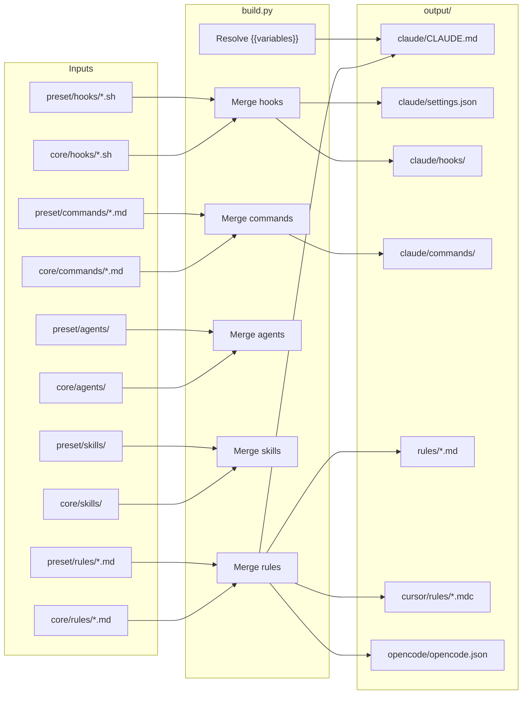
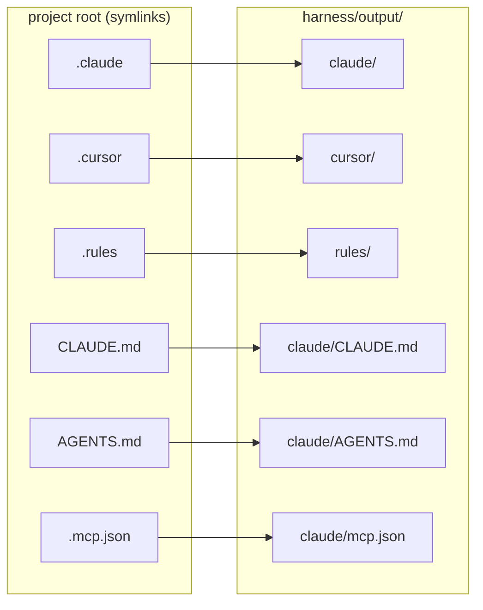
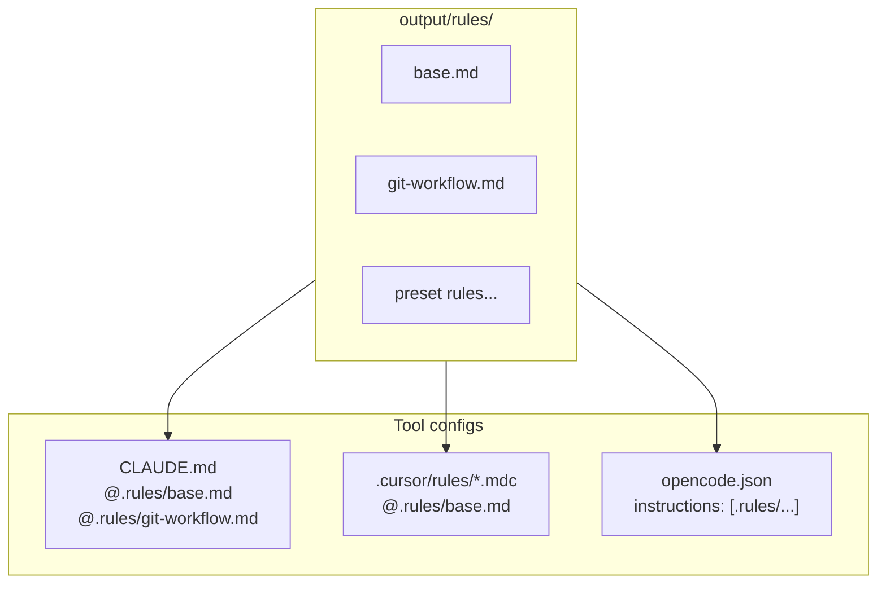
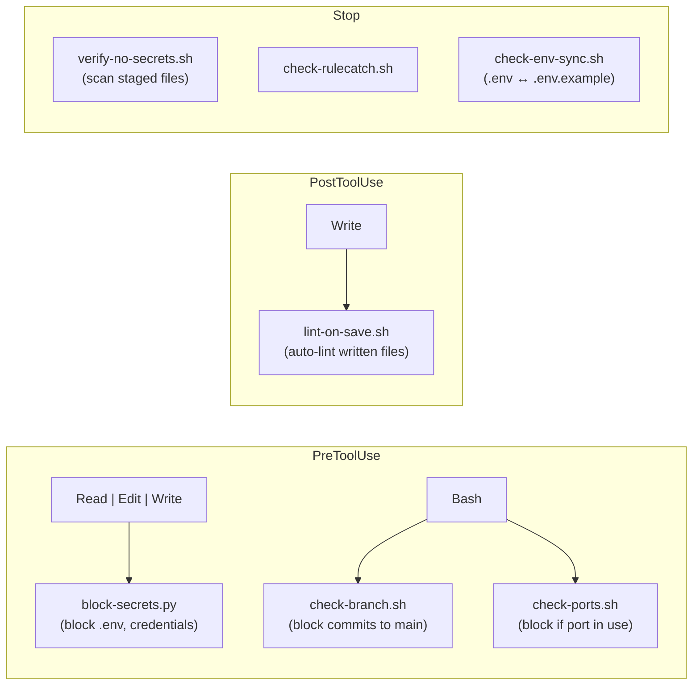

# Agent Harnesses

A composable AI agent configuration framework for **Claude Code**, **Cursor**, and **OpenCode**. Drop it into any project, run the setup wizard, and get working hooks, rules, commands, agents, and skills — with zero project-specific content unless you opt into a preset.

---

## Quick Start

```bash
# Option 1: Run from inside your project (harness/ is a subdirectory)
./harness/setup-harness.sh

# Option 2: Point at any project from the harness repo
./harness/setup-harness.sh ~/projects/my-app
```

The wizard will:

1. **Detect** your stack (Python, TypeScript, React, Go, Rust, etc.)
2. **List** available presets — pick the ones that match your project
3. **Merge** core + selected presets into `harness/output/`
4. **Symlink** from project root so every tool finds its config

```bash
# Rebuild after editing core/ or presets/:
./harness/setup-harness.sh --update ~/projects/my-app

# Replace symlinks with standalone copies:
./harness/setup-harness.sh --eject ~/projects/my-app
```

---

## Architecture



### How the build works

`build.py` reads `harness.config.json` and merges everything:



**Key behavior**: When core and a preset both declare hooks for the same matcher (e.g. `Bash`), their hook lists are **concatenated** — nothing is overwritten.

---

## Symlink Layout

After setup, symlinks at the project root point into `harness/output/`, so tools see their standard config locations:



All three tools (Claude Code, Cursor, OpenCode) consume the **same rules** from `output/rules/` — single source of truth:



---

## Hook Lifecycle

Claude Code hooks run at three phases. Each hook receives the tool call as JSON on stdin and can **block** an operation by exiting with code 2.



Presets can **add** hooks to any phase/matcher. For example, the Argus preset adds `check-rybbit.sh` and `check-e2e.sh` to the `Bash` matcher — they run alongside the core hooks.

---

## What's Included

### Core (always installed)

| Category | Contents |
|----------|----------|
| **Rules** | `base.md` (security, workflow, naming), `git-workflow.md` (branch-first) |
| **Hooks** | `block-secrets.py`, `check-branch.sh`, `check-ports.sh`, `lint-on-save.sh`, `verify-no-secrets.sh`, `check-env-sync.sh`, `check-rulecatch.sh` |
| **Commands** | `/help`, `/commit`, `/review`, `/worktree`, `/security-check`, `/refactor`, `/test-plan`, `/progress`, `/optimize-docker`, `/doctor`, `/skills`, `/test-harness` |
| **Agents** | Code reviewer (read-only audit), Test writer (creates tests with assertions) |
| **Skills** | Code review (triggered by "review", "audit", "check code") |

### Presets

Project-specific bundles that layer on top of core. Each has a `preset.json` declaring variables, rules, hooks, commands, skills, and agents.

| Preset | Description | Stack |
|--------|-------------|-------|
| `argus` | Financial research terminal — 13 DDD domains, LLM chat, widget canvas | React, FastAPI, Supabase |

---

## Template Variables

Core files can reference `{{VARIABLE_NAME}}` placeholders that resolve at build time:

| Variable | Default | Description |
|----------|---------|-------------|
| `{{PROJECT_NAME}}` | Directory name | Used in `/help` header, CLAUDE.md title |
| `{{DEFAULT_BRANCH}}` | `main` | Protected branch name |
| `{{FRONTEND_DIR}}` | `frontend` | Frontend source directory |
| `{{BACKEND_DIR}}` | `backend` | Backend source directory |

Variables are resolved in priority order: user config > preset defaults > built-in defaults.

---

## Creating a Preset

1. Create `harness/presets/<name>/preset.json`:

```json
{
  "name": "my-project",
  "description": "My project description",
  "version": "1.0.0",
  "stack": ["python", "react"],
  "variables": {
    "PROJECT_NAME": "My Project",
    "PORT_MAPPINGS": { "dev": 3000 }
  },
  "rules": ["rules/my-rules.md"],
  "hooks": {
    "PreToolUse": [{
      "matcher": "Bash",
      "hooks": [{ "type": "command", "command": "bash .claude/hooks/my-hook.sh" }]
    }]
  },
  "commands": ["my-command.md"],
  "skills": ["my-skill"],
  "agents": ["my-agent"]
}
```

2. Add your rules, hooks, commands, skills, agents in the preset directory
3. Run `./harness/setup-harness.sh` and select your preset

See [`harness/presets/argus/`](harness/presets/argus/) for a complete example.

---

## CLI Reference

```
Usage: setup-harness.sh [OPTIONS] [PROJECT_PATH]
```

| Command | Description |
|---------|-------------|
| `setup-harness.sh [path]` | Interactive setup wizard (path defaults to parent of harness/) |
| `setup-harness.sh --update [path]` | Rebuild `output/` from existing `harness.config.json` |
| `setup-harness.sh --eject [path]` | Replace symlinks with standalone file copies |
| `setup-harness.sh --help` | Show usage |

---

## Feature Support by Tool

| Feature | Claude Code | Cursor | OpenCode |
|---------|:-----------:|:------:|:--------:|
| Rules   | Full        | Full   | Full     |
| Hooks   | Full        | --     | --       |
| Commands | Full       | --     | --       |
| Skills  | Full        | --     | --       |
| Agents  | Full        | --     | Partial  |
| MCP     | Full        | Full   | Full     |

---

## Requirements

- Python 3.8+
- Bash
- Git
